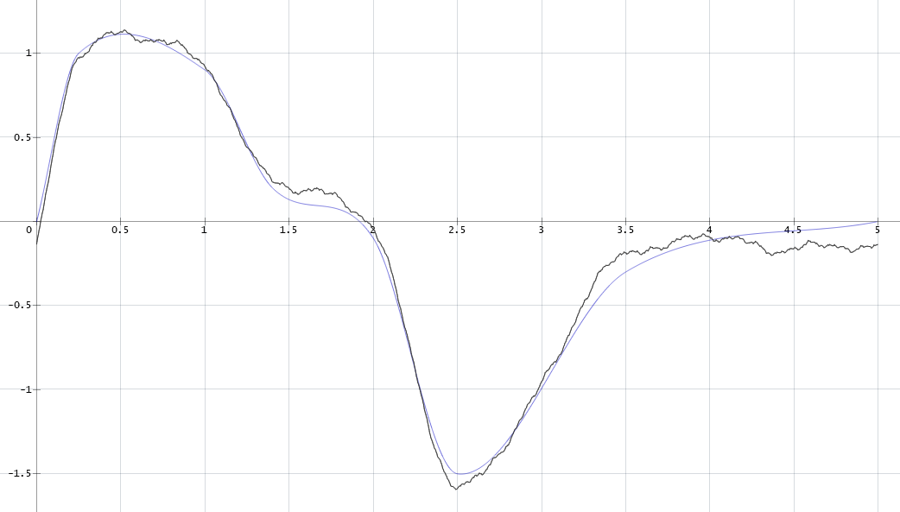
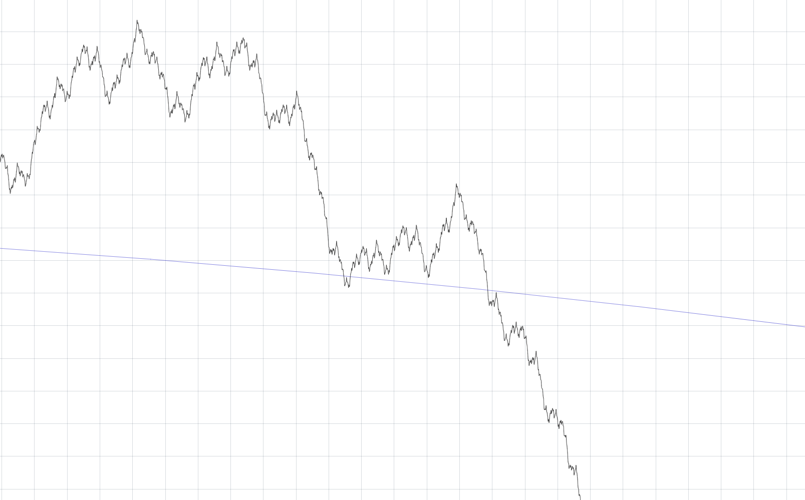
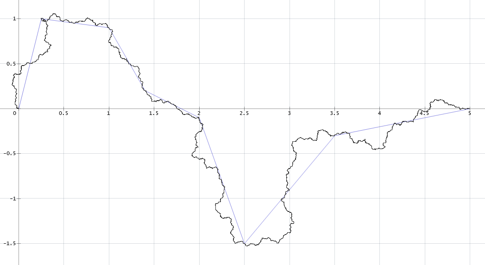
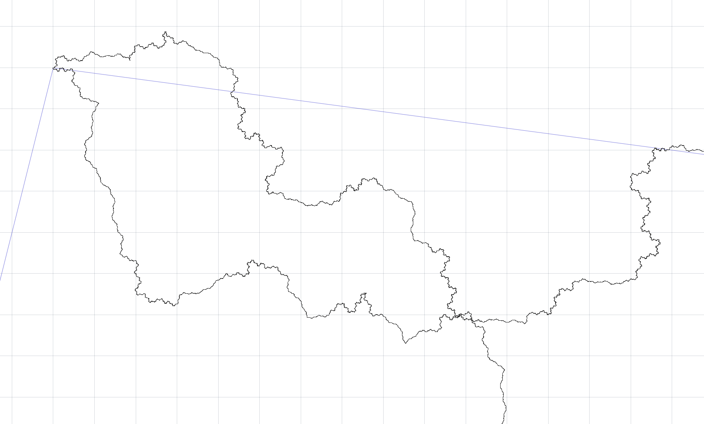

# Regular Fractal Curves

This project implements two models of adding fractal-like roughness to a given smooth curve. One adds temporally scaled harmonics signal to generate a Weierstrass-like fractal (see https://en.wikipedia.org/wiki/Weierstrass_function), while the other iteratively subdivides the segments of the initial polyline in a zig-zag pattern (the concept is similar to Koch curve [https://en.wikipedia.org/wiki/Koch_snowflake] and Dragon curve [https://en.wikipedia.org/wiki/Dragon_curve]).

|  |  |
| ----------------------------------------- | ---------------------------------------------------- |
|           |           |

### Building

The project uses a simple graphics library for Windows (found in `../_Graphics`). To build the project you can either use the included Code::Blocks project file (*.cbp) or edit the compiler paths in `build.bat` script and build the project using the provided `Makefile`.
